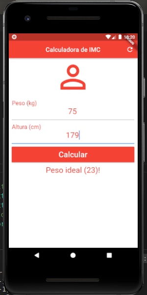
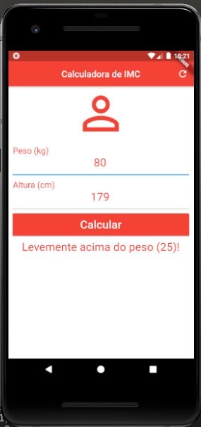

# flutter_studies

## Tests and studies flutter

<h4>Contador de pessoas</h4>

<h4>Calculadora imc</h4>
<h5>Aplicação para calcular o IMC (Índice de Massa Corporal). </h5>

  

  

div.box {
	width: 150px;
	display: inline-block;
}

<h4>Conversor de moedas </h4>
<h4>Lista de tarefas </h4>
